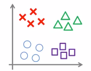

# 1. Optimization Objective
## 1. Logistic Regression
* Alternative view of logistic regression
    
    * Sigmoid

        

        
        

* Regularization
    * Greater number of features leads to overfitting
    * Regularization one way to avoid overfitting(high variance), other than reducing the number of features
    * Regularization decreases the affect of features

* Cost Function
    

    
    > A + λB: If λ is high, B gains more weight

## 2. Support Vector Machine
* Cost Function  

    $\underset{\theta}{\min}=C\sum_{i=1}^my^{(i)}cost_1(\theta^Tx^{(i)})+(1-y^{(i)})cost_0(\theta^Tx^{(i)})+\sum_{j=1}^n\theta_j^2$

    > CA + B: If C is high, A gains more weight; where C = 1/λ

* Hypothesis

$$h_\theta(x)=
\begin{cases}
1 & iff \ \theta^Tx \geq 0 \\
0 & \text{otherwise}
\end{cases}$$

# 2. Large Margin Intuition
* Cost Function
    

    

* Parameter C
    * When C is very large, minimize the first term to zero, leaving the regularization term
    * Suppose they are as very large as 10,000

* Decision Boundary: Linearly Separable Case
    * There could be multiple potential lines, but the black one seems the most robust
    * Grey lines generate the largest minimun distants (margins)
    * SVM is also called <strong>Large Margin Classifier</strong>

* Large Margin Classifier in Presence of Outliers
    * <strong>Large C</strong>
        * Narrow margin (lower rate of misclassification)
        * The value of cost function will be sensitive with regard to the deviation of the value of $\theta^Tx$ from the threshold value
        * Therefore, margin will be adjusted more strictly such that cost-function-increasing data placed outside the margin
        * Decision boundary like the blue line will be changed drastically by an outlier
    * <strong>Not too large C</strong>
        * Broad Margin (higher rate of misclassification)
        * The value of cost function will be resistant with regard to the deviation of the value of $\theta^Tx$ from the threshold value
        * Therefore, margin will be adjusted less strictly such that cost-function-increasing data may be placed inside the margin
        * Decision boundary like the black one will not be changed drastically by an outlier

# 3. Mathmatics Behind Large Margin Classification
### 1. Vector Inner Product
* Vector  
    
    $u = \begin{bmatrix}u1 \\ u2 \end{bmatrix}$
    $v = \begin{bmatrix}v1 \\ v2 \end{bmatrix}$

    

    

* Norm of the Vector  
$||u||=length\ of\ vector \ u=\sqrt{u_1^2+u_2^2}$  
$p=length \ of \ projection \ of v \ onto \ u$  
$u^Tv = p \cdot ||u||=u_1v_1+u_2v_2$
    > p has a sign depending on the angle between vectors
    > If the angle is greater than 90 degrees, then the sign of p is negative

### 2. SVM Decision Boundary
* $\Large \underset{\theta}{{\min}}=\frac{1}{2}\sum_{j=1}^n\theta_j^2$  

    $\theta^Tx^{(i)} \geq 1 \ if \ y^{(i)} = 1$  
    $\theta^Tx^{(i)} \leq -1 \ if \ y^{(i)} = 0$

    $Simplification: \theta_0 = 0,  n = 2$  
    $\underset{\theta}{{\min}}=\frac{1}{2}\sum_{j=1}^n\theta_j^2=\frac{1}{2}(\theta_1^2+\theta_2^2)={\frac{1}{2}(\sqrt{\theta_1^2+\theta_2^2})^2}=\frac{1}{2}||\theta||^2$  

* Inner product of $\theta^Tx^{(i)}$  

* $\theta^Tx^{(i)}=p^{(i)}||\theta||$  
    * As $\theta^Tx = 0$, $\theta$ is perpendicular with regard to $x$ 
    * If the margin is large, $p^{(i)}$ is little, causing $||\theta||$, as well as $J(\theta)$, to be greater
    * If the margin is small, $p^{(i)}$ is large, causing $||\theta||$, as well as $J(\theta)$, to be smaller

# 4. Kernels
## 1. Non-linear Decision Boundary
* Kernels allow us to make complex, non-linear classifiers using SVM

* $Predict \ y = 1 \ if$  

$$
\theta_0 + \theta_1x_1 + \theta_2x_2 + \theta_3x_1x_2 + \theta_4x_1^2+ \theta_5x_2^2 + \cdots \geq 0 \\
h_\theta(x) =
\begin{cases}
1, & if \ \theta_0 + \theta_1x_1+ \cdot\cdot\cdot \geq 0 \\
0, & otherwise
\end{cases}
$$

* The expression can be denoted as:  

$$
\theta_0 + \theta_1f_1 + \theta_2f_2 + \theta_3f_3 + \theta_4f_4 + \theta_5f_5 + \cdot\cdot\cdot 
$$

* The question: Is there a different / better choice of the features $f_1, \ f_2, \ f_3, \cdot\cdot\cdot \ ?$

## 2. Gaussian Kernel
### 1. Landmarks and Similarity

* Given $x$, compute new feature depending on proximity to landmarks $l^{(1)}, \ l^{(2)}, \ l^{(3)}$
> * One way to get the landmarks is to put them in the <strong>exact same</strong> locations as all the training examples
> * This gives us <strong>m</strong> landmarks, with one landmark per training example

$Given \ x: f_1=similarity(x,l^{(1)})=exp\left(-\frac{||x-l^{(1)}||^2}{2\sigma^2}\right)$  

$Given \ x: f_2=similarity(x,l^{(2)})=exp\left(-\frac{||x-l^{(2)}||^2}{2\sigma^2}\right)$  

$Given \ x: f_3=similarity(x,l^{(3)})=exp\left(-\frac{||x-l^{(3)}||^2}{2\sigma^2}\right)$

* This gives us a <strong>feature vector</strong>, $f_{(i)}$ of all our features for example $x_{(i)}$
* $f_0=1$ to correspond with $\theta_0$
* Training example $x_{(i)}$:

$$
x^{(i)} \rightarrow 
\left[\begin{matrix}
f_1^{(i)}=similarity(x^{(i)},l^{(1)}) \\
f_1^{(i)}=similarity(x^{(i)},l^{(2)}) \\
\vdots \\
f_m^{(i)}=similarity(x^{(i)},l^{(m)}) \\
\end{matrix}\right], x^{(i)} \in \mathbb{R}^{n+1}; \text{where m is the size of data, n the number of features }
$$

* Cost Function

$$
\underset{\theta}{\min}=C\sum_{i=1}^my^{(i)}cost_1(\theta^Tf^{(i)})+(1-y^{(i)})cost_0(\theta^Tf^{(i)})+\sum_{j=1}^m\theta_j^2
$$

### 2. Kernels and Similarity
* Gaussian Function as Similarity  
$Given \ x^{(i)}: f_i=similarity(x^{(i)},l^{(i)})=exp\left(-\frac{||x^{(i)}-l^{(i)}||^2}{2\sigma^2}\right)=exp\left(-\frac{\sum_{j=1}^n(x_j-l_j^{(i)})^2}{2\sigma^2}\right)$  
    > * Gaussian function computes the distance between vector $x$ and $l^{(i)}$
    > * The formular, the choice of similarity function is called Gaussian Kernel  
    > * The kernel function, $similarity(x,l^{(i)})$,  can also be denoted as $k(x, l^{(i)})$

* The value of the function ranges from 0 to 1, indicating the similarity

    $If \ x \approx l^{(i)}:f_1\approx exp\left(-\frac{\text{small number}}{2\sigma^2}\right) \approx 1$  
    $If \ x \ far \ from \ l^{(i)}:f_1\approx exp\left(-\frac{\text{large number}}{2\sigma^2}\right) \approx 0$

* The distribution of the Gaussian function is affected by the parameter $\sigma$ 

    * <strong>A</strong>: If $\sigma$ is small, the value of the function would decrease steeper as feature vector($x$) gets further from vector $l$
    * <strong>B</strong>: If $\sigma$ is small, the value of the function would decrease gentler as feature vector($x$) gets further from vector $l$

* Given $\theta^T$ optimized by cost function, now $\theta^Tf$ can be evaluated with test data
    * Predict "1" when $\theta^Tf \geq 0$
    * Predict "0" otherwise

### 3. SVM with Kernels
* Hypothesis: Given x, compute features $f \in \mathbb{R}^{m+1}$ (Optionally plus one depending on the constant feature)
    * Predict "y=1" if $\theta^Tf \geq 0$
    * Training

        $\underset{\theta}{\min}=C\sum_{i=1}^my^{(i)}cost_1(\theta^Tf^{(i)})+(1-y^{(i)})cost_0(\theta^Tf^{(i)})+\sum_{j=1}^{\color{yellow}{m}}\theta_j^2$
        > * Note "m" in the second term for it should be the effective number of features of x
        > * Also in the second term, j starts from 1 because $\theta_0$ is not regularized
        > * $\sum_{j=1}^m\theta_j^2 = \theta^T\theta$, but use $\theta^TM\theta$ instead
        > * $M$ depends on the distance measure and it allows the SVM computation work more efficiently.

* SVM Parameters
    * $C(=\frac{1}{\Lambda})$
        * Large $C$ (small $\lambda$): lower bias, high variance (overfitting)
        * Small $C$ (large $\lambda$): higher bias, low variance (underfitting)

    * [$\sigma^2$](#sigma)
        * Small $\sigma^2$: features $f_i$ vary less smoothly; lower bias, higher variance (overfitting)
        * Large $\sigma^2$: features $f_i$ vary more smoothely; higher bias, lower variance (underfitting)

# 5. SVM in Use
## 1. Things to be Specified
* C
* Kernel
    * No kernel (linear kernel)
    * Gaussian kernel
        > Choose $\sigma^2$
        > Perform feature scaling in advance
        > Technical condition called "Mercer's Theorem" need to be satisfied
    * Many off-the-shelf kernels are available: 
        * Polynomial kernel: $k(x, l)=(x^Tl+constant)^{degree}$
        * Many esoteric: string kernel, chi-square kernel, histogram intersection kernel etc

## 2. Multiclass Classification

 

$$
y\in\{1, 2, 3, \ldots , K\}
$$
* Many SVM packages already have built-in multi-class classification functionally
* Otherwise, use one-vs-all method
    * Train $K$ SVMs, one to distinguish $y=i$ from the rest, for $i=1, 2, \ldots, K$
    * Get $\theta^{(1)}, \theta^{(2)}, \ldots, \theta^{(K)}$
    * Pick class i with the largest $(\theta^{(i)})^Tx$ (hyperplane)
    * That the hyperplane is large "positive" value means that the data is for sure classified as 1

## 3. Logistic Regression vs. SVMs
$n=\text{number of features} (x \in \mathbb{R}^{n+1}), m = \text{number of training examples}$

* n > m: logistic regression or linear kernel
* small n & medium m: Gaussian kernel
* small n & large m: add features with logistic regression or linear kernel
* Neural Network likely to work well for most of these settings, but may be slower to train