# 1. Optimization Objective
## 1. Logistic Regression
* Alternative view of logistic regression
    
    * Sigmoid

        
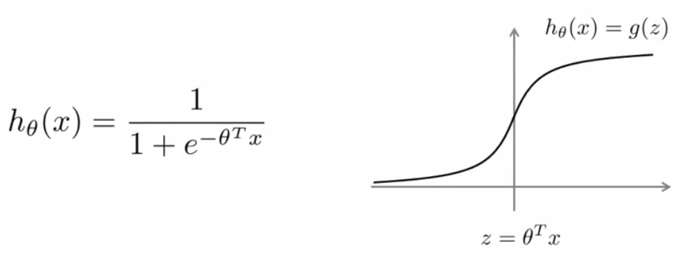

        
        
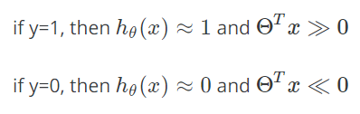

* Regularization
    * Greater number of features leads to overfitting
    * Regularization one way to avoid overfitting(high variance), other than reducing the number of features
    * Regularization decreases the affect of features

* Cost Function
    
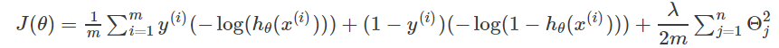

    
    > A + λB: If λ is high, B gains more weight

## 2. Support Vector Machine
* Cost Function  
    
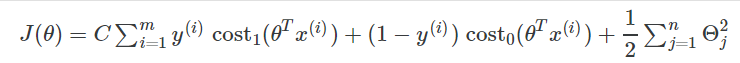

    > CA + B: If C is high, A gains more weight; where C = 1/λ

* Hypothesis
    
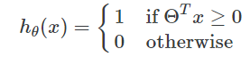

# 2. Large Margin Intuition
* Cost Function
    

    
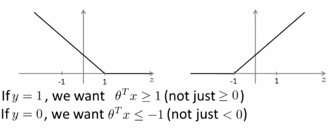

* Parameter C
    * When C is very large, minimize the first term to zero, leaving the regularization term
    * Suppose they are as very large as 10,000

* Decision Boundary: Linearly Separable Case
    * There could be multiple potential lines, but the black one seems the most robust.
    * Grey lines generate the largest minimun distants (margins)
    * SVM is also called <strong>Large Margin Classifier</strong>

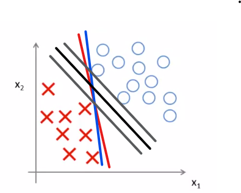

* Large Margin Classifier in Presence of Outliers
    * Large C
        * Narrow margin (lower rate of misclassification)
        * The value of cost function will be sensitive with regard to the deviation of the value of $\theta^Tx$ from the threshold value
        * Decision boundary like the blue line will be changed drastically by an outlier
    * Not too large C
        * Broad Margin (higher rate of misclassification)
        * The value of cost function will be resistant with regard to the deviation of the value of $\theta^Tx$ from the threshold value
        * Decision boundary like the black one will not be changed drastically by an outlier

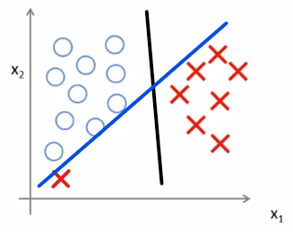

# 3. Mathmatics Behind Large Margin Classification
### 1. Vector Inner Product
* Vector  
    
    $u = \begin{bmatrix}u1 \\ u2 \end{bmatrix}$
    $v = \begin{bmatrix}v1 \\ v2 \end{bmatrix}$

    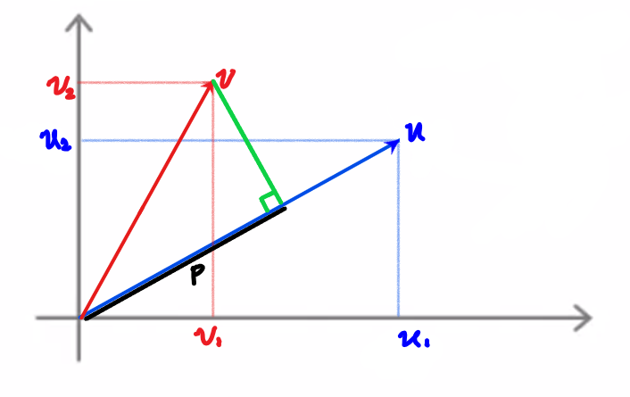

    

* Norm of the Vector  
$||u||=length\ of\ vector \ u=\sqrt{u_1^2+u_2^2}$  
$p=length \ of \ projection \ of v \ onto \ u$  
$u^Tv = p \cdot ||u||=u_1v_1+u_2v_2$
    > p has a sign depending on the angle between vectors

### 2. SVM Decision Boundary
* $\Large \underset{\theta}{{\min}}=\frac{1}{2}\sum_{j=1}^n\theta_j^2$  

    $\theta^Tx^{(i)} \geq 1 \ if \ y^{(i)} = 1$  
    $\theta^Tx^{(i)} \leq -1 \ if \ y^{(i)} = 0$

    $Simplification: \theta_0 = 0,  n = 2$
    $\underset{\theta}{{\min}}=\frac{1}{2}\sum_{j=1}^n\theta_j^2=\frac{1}{2}(\theta_1^2+\theta_2^2)={\frac{1}{2}(\sqrt{\theta_1^2+\theta_2^2})^2}=\frac{1}{2}||\theta||^2$

* Inner product of $\theta^Tx^{(i)}$  
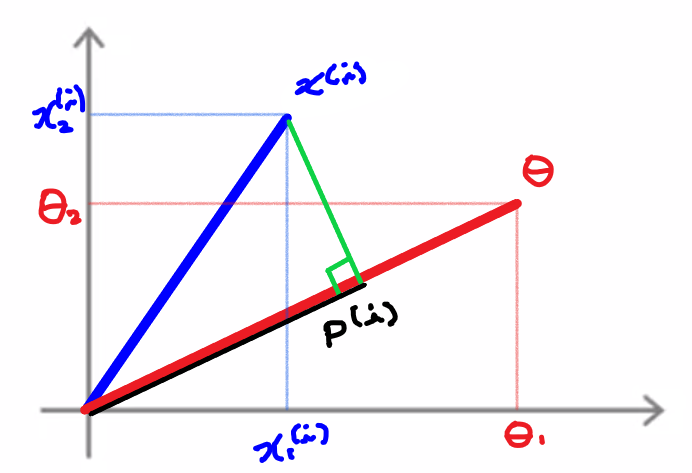

    $\theta^Tx^{(i)}=p^{(i)}||\theta||$  
    * As $\theta^Tx = 0$, $\theta$ is perpendicular with regard to $x$ 
    * If the margin is large, $p^{(i)}$ is little, causing $||\theta||$, as well as $J(\theta)$, to be greater
    * If the margin is small, $p^{(i)}$ is large, causing $||\theta||$, as well as $J(\theta)$, to be smaller

# 4. Kernels
## 1. Non-linear Decision Boundary

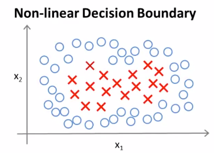

* $Predict \ y = 1 \ if$  

$$
\theta_0 + \theta_1x_1 + \theta_2x_2 + \theta_3x_1x_2 + \theta_4x_1^2+ \theta_5x_2^2 + \cdot\cdot\cdot \geq 0 \\
h_\theta(x) =
\begin{cases}
1, & if \ \theta_0 + \theta_1x_1+ \cdot\cdot\cdot \geq 0 \\
0, & otherwise
\end{cases}
$$

* The expression can be denoted as:  

$$
\theta_0 + \theta_1f_1 + \theta_2f_2 + \theta_3f_3 + \theta_4f_4 + \theta_5f_5 + \cdot\cdot\cdot 
$$

* The question: Is there a different / better choice of the features $f_1, \ f_2, \ f_3, \cdot\cdot\cdot \ ?$

## 2. Kernel
* Given $x$, compute new feature depending on proximity to landmarks $l^{(1)}, \ l^{(2)}, \ l^{(3)}$

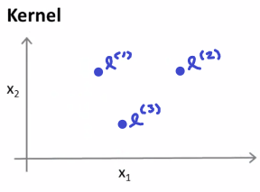

$\Large Given \ x: f_1=similarity(x,l^{(1)})=exp(-\frac{||x-l^{(1)}||^2}{2\sigma^2})$